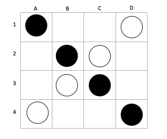
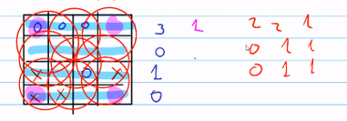

# Assignment 3 - Sistemas Inteligentes
# Cuatela

# Project Description

- The board starts with the black pieces positioned on the diagonal of the board and the white ones on the opposite diagonal of the board, in this way:

    
  </a>

- In the game always start playing the black pieces, Each piece can be moved in 8 directions horizontally, vertically or diagonally (N,S,E,O, NE, NO, SE, SW) when possible and there is no obstruction. You always move the maximum number of free places you have in that direction and the player who arranges his four chips horizontally, vertically, forming a square or positioning his chips in the four corners wins.

- To implement the program and make its own decisions, you must define a heuristic that determines the utility value of a state, define a maximum height to expand the game tree that will decide how far said tree should be explored, and Implement the algorithm MinMax + α − βpruning and MinMaxW ithDepth(cut − off).

# how to run the code
- run : 
https://colab.research.google.com/drive/14n2AsEQeU5S0L57EbLLdELEM25-JvBYp?usp=sharing

You can also

- make a git clone:

https://github.com/jona-terceros/cuatela.git

# Solution description

- The first thing that was done was to create the board on which the game will take place.
We define the rules that are specified in the assignmet document, such as the types of wins, the starting order of the pieces, the types of movement etc.
Subsequently, we proceeded to create an 'actions' function that returns a list of all the possible actions that the 'player_ai' can perform. This function is very important for the implementation of the recursive functions used by alpha beta pruning.
Other important functions that were coded were the terminal_test functions, and the utility.

### Explanation of the heustics that determines the utilitarian value of a state:

The heuristic that our code uses is to get the numbers of pieces aligned horizontally, vertically, in the corners, and in the inner squares (2x2 matrices) of the board. These values are stored in a list called 'values list'. From this list the highest value is chosen, which represents the number of pieces best aligned according to our victory parameters. 
Now, we could return this value as the utility value but we know  that there are states in which I have a higher range of good moves, for this reason in the 'values_list' it was seen to be convenient to count the number of available good moves and the higher the quantity, a number is added to the value returned by the utility function.

    
  </a>

